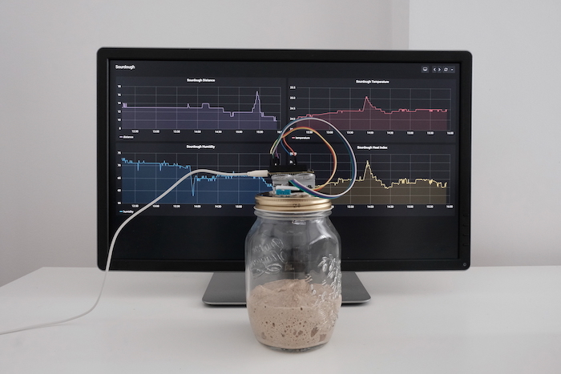

# Sourdough Starter Monitor 🍞

This fun project was created during [Grafana](https://www.grafana.com) hack days and inspired by [sourd.io](https://www.sourd.io/).

To re-create this monitoring solution for your sourdough starter you can go follow this [step-by-step guide](https://grafana.com/blog/2020/06/17/how-to-monitor-a-sourdough-starter-with-grafana/).

You will need:

- **1 DHT11** sensor to measure temperature and humidity
- **1 HC-SR04** ultrasonic distance sensor
- **1 ESP32-PICO-KIT V4** development board
- **7 M-F Dupont Cabels**
- **1 micro USB cable**
- **1 USB charger**
- **1 Jar** with the lid that can be cut
- **Glue**

Used Arduino Libraries:

- DHT sensor library by Adafruit
- Adafruit Unified Sensor by Adafruit
- NTP Client by Fabrice Weinberg
- HCSR04 by Martin Sosic

To store the data I have used locally run [InfluxDB](https://www.influxdata.com/). And for visualisation I've used Grafana.

