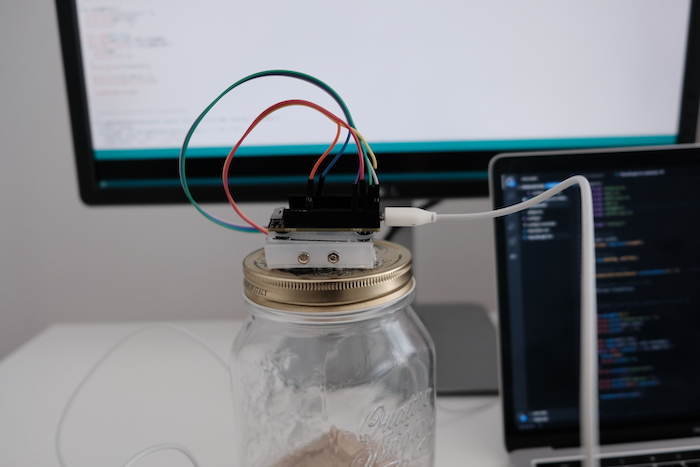
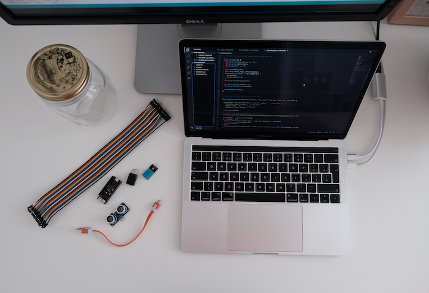
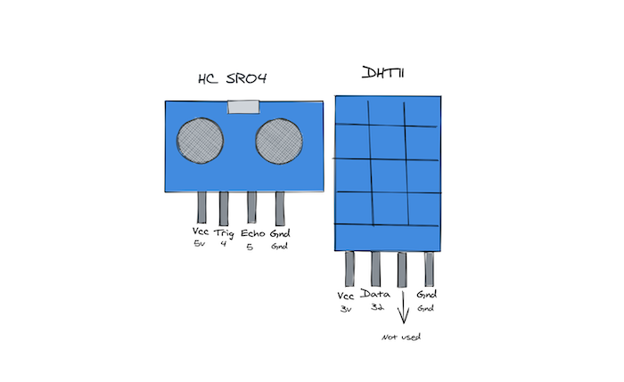
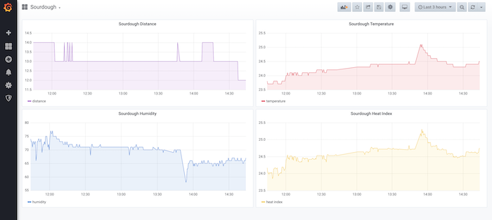

# Sourdough Monitor 🍞

This fun project was created during [Grafana](https://www.grafana.com) hack days and inspired by [sourd.io](https://www.sourd.io/).

To re-create this monitoring solution for your sourdough starter, you will need:

- **DHT11** sensor to meassure temperature and humidity
- **HC-SR04** ultrasonic distance sensor
- **ESP32-PICO-KIT V4** development board
- **M-F Dupont Cabels**
- **micro USB cable**
- **Jar** with the "cuttable" lid

Used Arduino Libraries:

- DHT sensor library by Adafruit
- Adafruit Unified Sensor by Adafruit
- NTP Client by Fabrice Weinberg
- HCSR04 by Martin Sosic

To store the data I have used locally run [InfluxDB](https://www.influxdata.com/). And for visualisation I've used Grafana.

